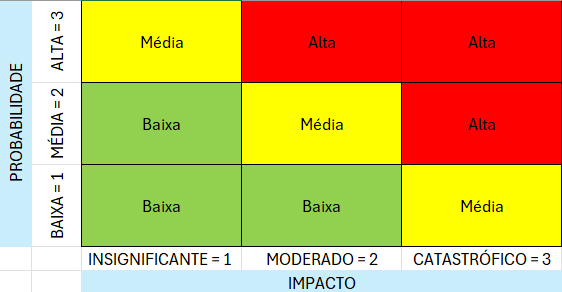

# Projeto EsToDoList

---

---

# Seção 1: Objetivo do Projeto

O objetivo dele é ajudar os estudantes, colocando, editando as tarefas e ajudando na organização dele para realizar as lições de casa e as provas, de uma forma que consiga se organizar melhor sozinho, sem depender das outras pessoas, e podendo também marcar se realizou a tarefa ou não.

# Seção 2: Requisitos Funcionais (RF)

1. O professor vai precisar abrir a agenda, achar o dia que terá tarefa ou prova, e vai precisar informar, qual é a tarefa incluindo qual é a atividade, página e capítulo, e colocar também qual é a matéria, quando for prova precisará falar o que irá cair, como capítulo ou o assunto em si. E os alunos para anotar que fez, vão entrar na agenda, clicar na tarefa, e colocar se foi feito ou não, quando colocar vai ficar um certo do lado da tarefa que realizou.
2. O professor vai poder clicar no dia que colocou a tarefa, e irá aparecer para ele editar ou excluir ela, é só o professor poderá fazer isso, e quando fazer vai chegar uma uma notificação falando que a tarefa de tal matéria foi alterada ou excluída. Já os alunos poderão clicar na tarefa e mudar se fez ou não ela, só mudando ela de realizado para não realizado.
3. Quando o professor for excluir uma tarefa, vai ter um botão para confirmar a exclusão e deve informar para os alunos, falando que excluiu a tarefa e por que a exclusão(opcional).
4. Quando os alunos terminarem a tarefa e anotar que fez vai ficar um certo do lado da tarefa que realizou, para mostrar que fez.
5. Ele poderá pesquisar a matéria para que aparece todos os dias que tem tarefa ou prova da matéria, até às passada(limite de 2 meses, para que continue aparecendo), e para pesquisar o dia vai ser uma forma igual a agenda do computador, vai passando de mes em mes, em quando for no mes, vai aparecer todos os dias, e qual tiver com tarefa vai ficar com um sinal de ! para ajudar a visualização.

# Seção 3: Requisitos Não Funcionais (RNF)

1. Responsividade
- O sistema deverá funcionar corretamente em computadores, tablets e celulares, adaptando sua interface para diferentes tamanhos de tela
1. Facilidade de Uso
- A interface deverá ser simples, organizada e fácil de entender, permitindo que o usuário utilize as principais funções sem dificuldades.
1. Desempenho
- O sistema deverá responder rapidamente às ações realizadas pelo usuário, como cadastrar, editar, excluir ou pesquisar tarefas.

# Seção 4: Fora de Escopo

1. Sistema de Trabalho em Grupo
- A possibilidade de compartilhar tarefas com outros estudantes ou criar listas colaborativas também ficará fora do escopo inicial
1. Personalização Avançada
- A possibilidade de personalizar completamente o sistema, como alterar temas, cores, fontes ou criar diferentes estilos de interface

---

---

# Metodologia Cascata

| REQUISITOS | ANÁLISE E PROJETO | DESENVOLVIMENTO | TESTES | IMPLANTAÇÃO E MANUTENÇÃO |
| --- | --- | --- | --- | --- |
| Escrever o Documento de Escopo com todas as funcionalidades. | Desenhar as telas do aplicativo no Figma. | Escrever o código HTML da página principal. | Verificar se o aplicativo funciona corretamente nos navegadores Chrome e Firefox. | Publicar a versão final do site em um servidor online para que todos possam usar. |
| Entrevistar alunos para entender como eles organizam suas tarefas hoje. | Definir a paleta de cores e a fonte que serão usadas no site. | Programar a função em JavaScript que salva uma nova tarefa no navegador. | Tentar “quebrar” o campo de data, inserindo um texto em vez de um número. | Corrigir um bug reportado por um usuário uma semana após o lançamento |
| Definir os requisitos funcionais e não funcionais do sistema. | Criar o modelo do banco de dados para armazenar tarefas, usuários e matérias. | Desenvolver as funções de cadastro, edição e exclusão de tarefas. | Testar o sistema em diferentes tamanhos de tela, como computador, tablet e celular. | Configurar o domínio e o ambiente de hospedagem do sistema. |

---

---

# Matriz De Risco

## Legenda:

✅ Aceitar : O risco é baixo e não exige uma ação específica.

🟡Observar : o risco ainda não

atenção

risco

---

---

EXEMPLOS :

| Risco (Descrição) | Probabilidade (Baixa/Alta) | Impacto (Baixo/Alto) | Plano de Ação (O que faremos para prevenir ou remediar ?) |
| --- | --- | --- | --- |
| Ex : O único programador do projeto fica doente e se ausenta por uma semana. Risco de Recursos | Baixa | Alto | Plano de Ação: Manter toda a documentação do projeto atualizada e salva em um local compartilhando, para que outra pessoa possa entender o andamento |
| E se todo o código desenvolvido em aula fosse perdido porque ninguém faz commit ou enviou o projeto para o GitHub? | Baixa | Alta | Postar no GitHub para não perder o código, e salvar o código toda vez que for parar de mexer nele. |
| Internet indisponível no momento da entrega/ apresentação | Baixa | Média | Salvar o trabalho em pen-drive para conseguir apresentar sem a internet. |
| Durante o desenvolvimento do EsToDoList, os alunos que testaram o sistema gostaram da ideia e começaram a pedir um chat para conversar sobre as tarefas? | Alta | Média | Explicar que o chat não faz parte do escopo inicial do projeto. Registrar a sugestão para uma possível versão futura, mantendo o foco nas funções principais do sistema. |